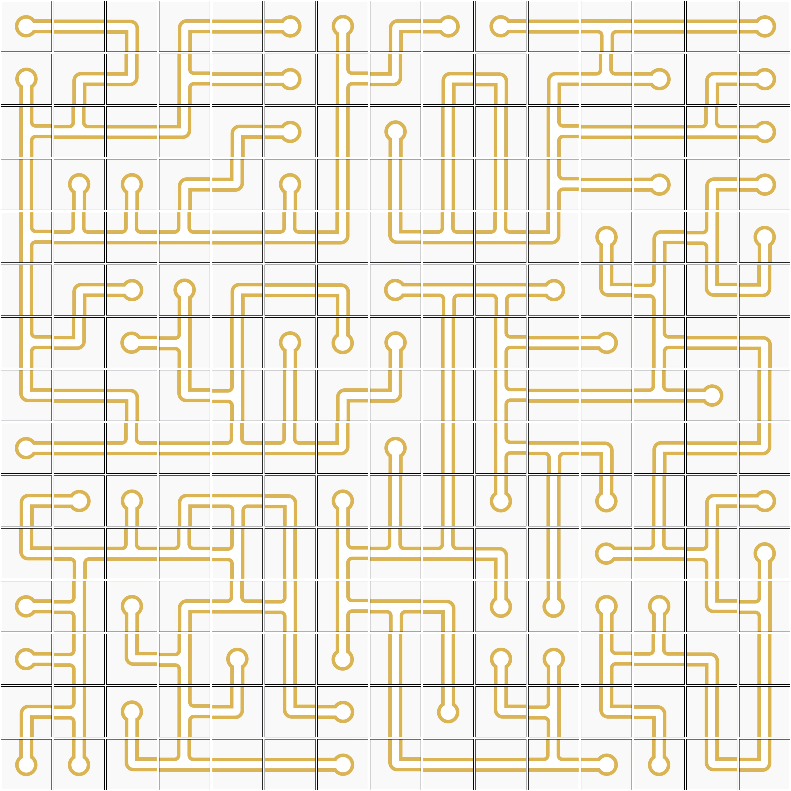

# Artificial Intelligence

Project consists of a program capable of solving problems similar to those in the late 80s game <a href="https://en.wikipedia.org/wiki/Pipe_Mania">"Pipe Mania"</a>.
It figures out how to rotate multiple pipe pieces of different types in a grid to achieve an interconnected system, with no leaks.

In the repo, simply run one of test cases by using `python pipe3.py < test.txt` where text.txt is a valid input pipe grid.

> Since the .py ran on a evaluation system, the repo isn't very "clean", note that the version to be ran is `pipe3.py`. Also do note that you can visualize any pipe grid, whether a test case or a generated solution, by simply using `python visualizer.py < pipe.txt` where pipe.txt is any valid pipe grid

An example of how the visualizer might look like is:

    

### Solution
Our solution simply performs a AC-3 algorithm on all arcs, which by itself significantly limits the possible value of every pipe piece, propagating the known initial restrictions (border pieces can't have certain values). Afterwards, it performs a depth-first-tree-search on the pipes states until it reaches the solution (on the already severely limited options).
